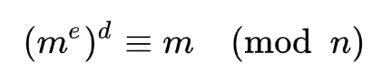
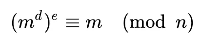
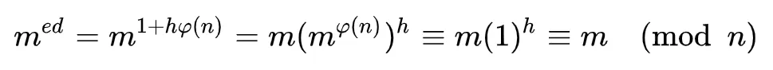

# RSADemo
A simple java code to demonstrate how [RSA](https://en.wikipedia.org/wiki/RSA_(cryptosystem)) works.

Here is a brief write in Chinese:

# RSA算法

RSA算法是一种常用的非对称加密算法。它的加解密算法的数学基础是模幂运算和质数的一些性质。

## 模幂运算(Module Exponentiation)

   模幂运算是类似这样的一种运算： 底数m的e次幂除以n的模（余数）：
   
   c ≡ me mod n  (公式一）
      
   它表示c与me除以n余数相同（同余）。取余数其实是一个单向的部分信息丢失的运算。
   
   以上模幂运算具有如下的的性质：
   
       给出m,e和n，很容易的计算出c。
               
       给出c,e和n，很难计算出m。
               
       给出c,m和n，很难计算出e。
   
   如果把上述公式作为加密算法，那么m是明文；e是公钥；n也是公钥的一部分，加密需要它；c是密文。根据模幂运算的上述特性，我们可以得知相应地：
   
      由明文和公钥可以得到密文。
           
      由密文和公钥无法计算出明文。
           
      由明文，密文和公钥中的m,无法计算出加密过程使用的密钥。
   
   上面只是模幂运算的一个介绍，模幂并不能用来作为加密算法。因为上面的算法不包含解密方法。

## RSA加解密算法
   RSA加解密算法实际上依赖于下面的模幂运算原理：我们可以找出一组数e，d和n，使得对于任何小于n的正整数m满足以下等式：
   
   (公式二）
   
   上面的等式是一个模算术（Modular arithmetic）等式。中间的三横表示它的左边和右边同余。后面的(mod n)表示三横的左边和右边是除以n同余。
   
       
   由于m≤n，所以m%n=m。也就是说上面的等式意味着，我们可以对m做两次模幂运算，分别使用e和d作为指数，其结果仍然是m。并且上面的等式具有如下数学性质，知道n，e，m以及me，很难计算出d。因此我们可以把e作为公钥，d作为私钥。并且根据前面提到的公式一的性质，已知e和me(公式一中的c)也无法得知m，也就是说密文无法通过公钥解密，因此密文是安全的。
   
   
   上面公式二中的d和e也可以互换位置，等式依然成立：
   
   
   根据这个性质，密钥持有者可以用密钥d对明文m作数字签名产生md，公钥持有者可以利用公钥e再对md做模幂运算得到m来证明发出md的信息方必然持有d。这也就是数字签名的过程。
   
   上面的加解密过程都很简单，只做一次模幂运算。那么我们怎么得到一组可用的d、e、n呢？也就是如何产生密钥对呢？
   

## RSA产生d,e和n的方法如下

1. 随机选择两个大素数p和q;
2. n = p*q;
3. 计算λ(n) — Carmichael函数
   
   它定义为使下面等式成立的最小m取值。其中a是1和n之间每一个与n互质的数。

      am ≡ 1   (mod n)

   根据λ(n)函数的性质，λ(p*q)=lcm(λ(p), λ(q))。lcm: 最小公倍数。
   
   并且，由于p,q都是素数，λ(p)=φ(p)=p-1, λ(q)=φ(q)=q-1。
   
       (φ(n) - 欧拉函数Euler's totient function, 小于n且与n互质的正整数个数。).
   
   因此, λ(n)=lcd(p-1, q-1)。

4. 选择一个e：找出一个与λ(n)互质的数e且1 < e < λ(n)。
5. 计算出e关于λ(n)的模反数d。模反数，是指两个数的乘积对某个数（此处为λ(n)）取余数得1。即找到d,使得： 
   ed ≡ 1   (mod λ(n))

   
   由费马小定理或欧拉定理可以证明此过程产生的d, e, n可以使公式二成立。欧拉定理证明：
   

   至此我们得到了公钥和私钥对。公钥是e和n。密钥是d。p, q和λ(n)是需要保密的随机数和中间结果，计算完后可以抛弃。